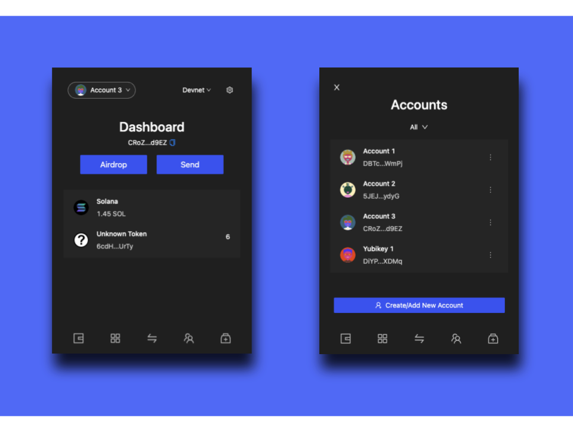

# Krypton Wallet

Introducing Krypton, a Solana smart contract wallet with multisig social recovery, eliminating fear of losing your private key and improving usability and security with advanced features

## ✨ Key Features

- Self custody without seed phrases (not good user experience)
- Social recovery with guardians (people, secondary wallet)
- Seamless integration with Yubikey as a physical wallet
- Setting transaction limit to prevent wallets being emptied
- Ability to interact with arbitrary smart contracts
- Customized avatar based on public key generated fully on-chain

<!--  -->

## 👀 High-level Overview

- Consists of 4 main repositories:
  - **`chrome-extension`**: User-facing wallet UI
  - **`wallet-program`**: Solana wallet smart contract
  - **`recovery-ui`**: Wallet recovery web frontend
  - **`wallet-standard`**: Solana wallet standard implementation
